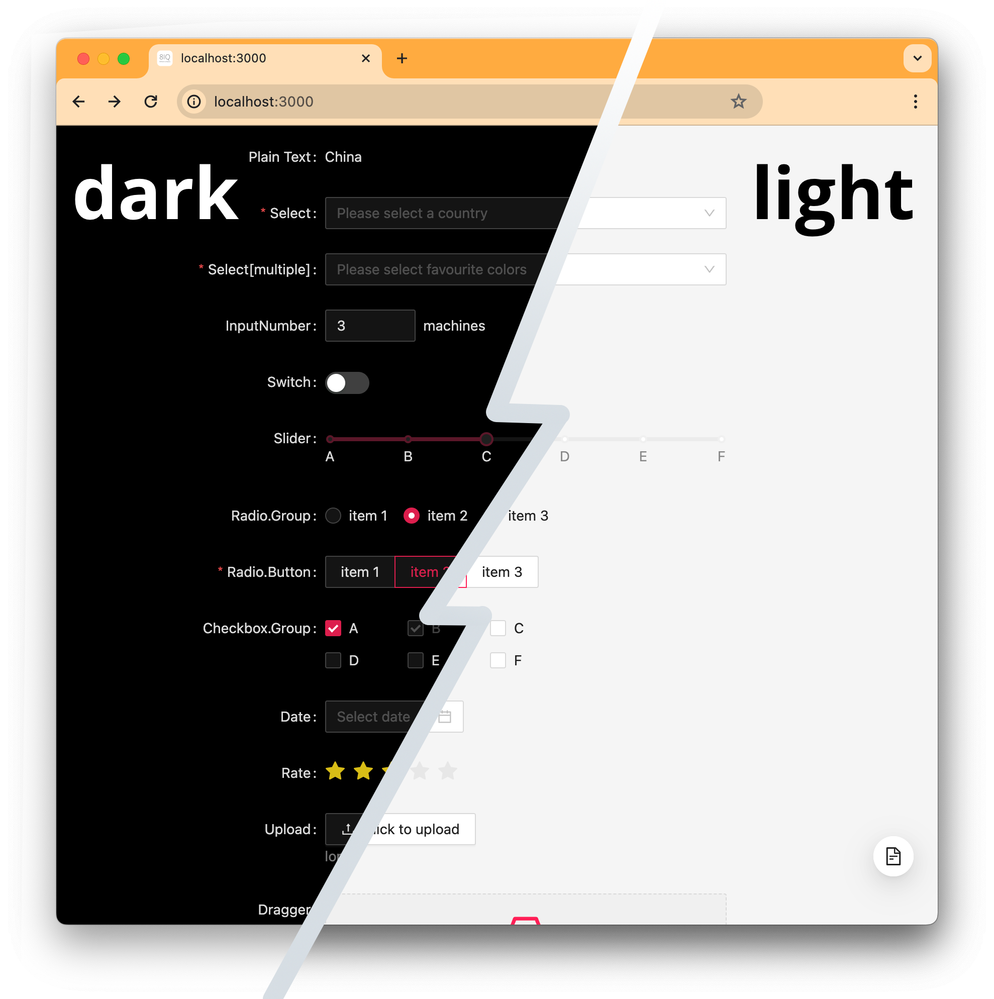

What's inside? React + Next.js + Ant + Turbo + react-i18next + Refine

# Rapid Development Node.js Hackathon template

- [Motivation & Features](#why)
- [Getting started](docs/getting-started.md)
- [Deploy](docs/deploy.md)
- [Contributing](docs/contributing.md)

## Why?

When you start a new project, you need a time-tested approach to development.
You need to prepare the basic structure of the project, implement registration and authorization.

If you are making a B2B solution, you need to implement roles and access rights and the possibility of invites.

You need to implement notifications, page templates, and internationalization support.

Using a template, you don't have to spend hours choosing technologies and gluing them together.

The libraries used can be changed over time.

Don't start by choosing a technology, start implement your key features!

Our focus is to use the technologies that allow you to save your time and maximize your development experience.

You can use this project if you are going to launch a new startup or participate in a hackathon.

## Features

Full list of features and requested features is found under [contributing.md](docs/contributing.md) and issues

## Getting started

Check [getting-started.md](docs/getting-started.md)

## Deploying

Check [deploy.md](docs/deploy.md)
