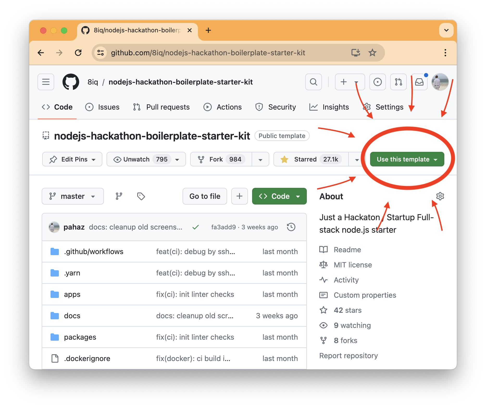

# Init your own monorepo

You should have `docker-compose`, `git` and `node` commands.
You can create a fork of [boilerplate](https://github.com/8iq/nodejs-hackathon-boilerplate-starter-kit)
by click on GitHub `Use Template` button or fork the repo.



```bash
# 1) Click `Use Template`: https://github.com/8iq/nodejs-hackathon-boilerplate-starter-kit

# 2) Clone your repo!
git clone git@github.com:USERNAME/REPOSITORY.git my-new-startup
cd my-new-startup

# 3) Install dependencies and link workspaces
yarn
```

# create new package

Just use `turbo gen workspace` to create a new package

# create new app

Just use `turbo gen workspace --copy ./apps/web` to create a new app
